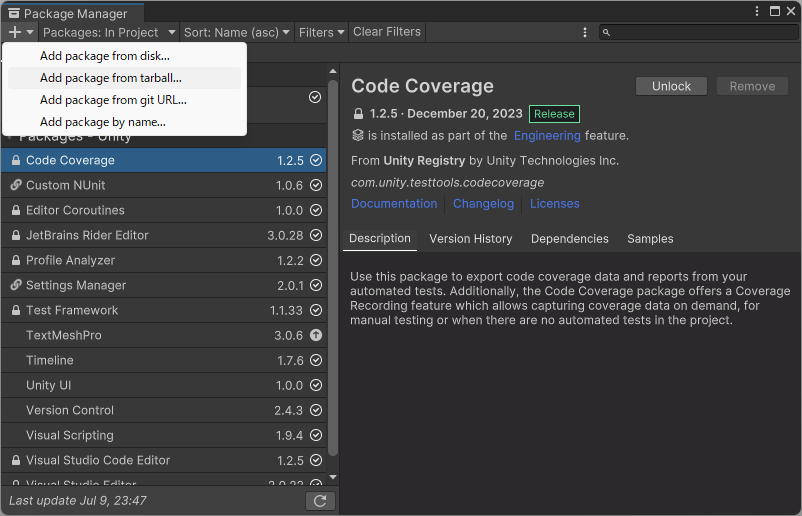
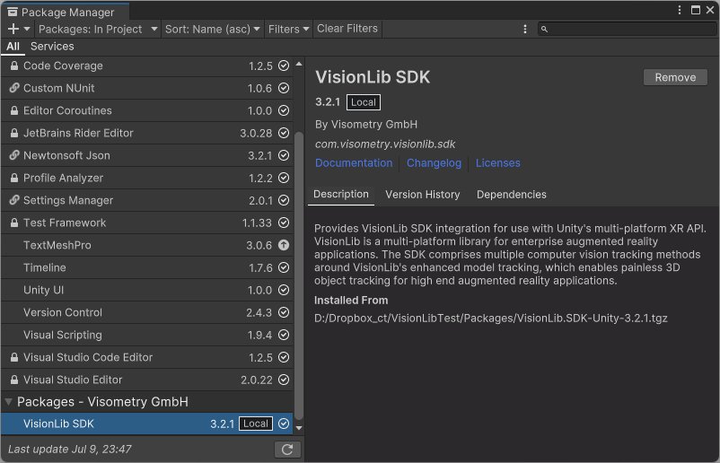
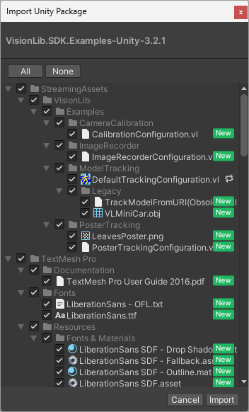
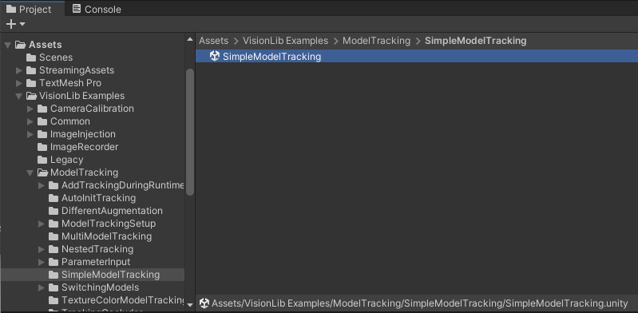
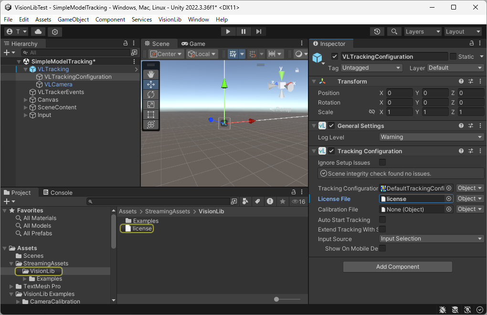
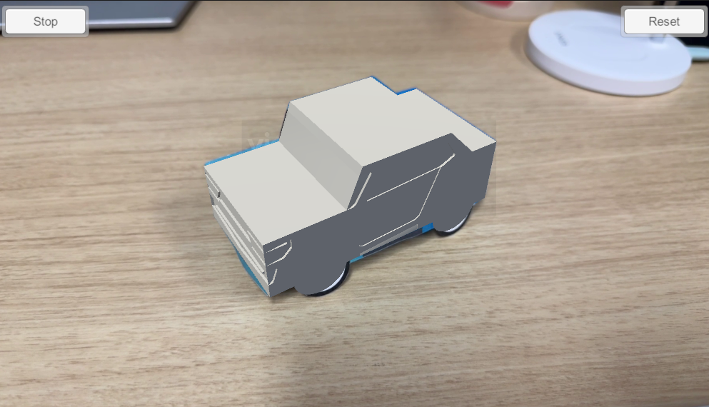

# VisionLib の導入

## ダウンロードとインストール

VisionLib を使うには、まず [公式サイト](https://visionlib.com/) でアカウントを作成し、ライセンスファイルとパッケージファイルをダウンロードします。トライアルライセンスは、アカウント作成から 30 日間有効です。

ログイン後、[Your Personal Area](https://visionlib.com/personal-area/)のページにアクセスすると、ライセンスファイルとパッケージファイルをダウンロードすることができます。

以下では、2024/7/10 時点の最新版である下記バージョンを利用して進めていくものとします。

- Unity: 2022.3.35f1 (LTS)
- VisionLib: VisionLib.SDK.Unity v3.2.1

**参考**

1. [Installation Guides (Unity Development)](https://docs.visionlib.com/v3.2.1/#/Install_VisionLib/InstallUnity)
2. [Full Documentation](https://docs.visionlib.com/v3.2.1/#/)

ダウンロードした `VisionLib.SDK-Unity-3.2.1.zip` は、ローカルに解凍しておきます。

## Unity プロジェクトの作成

空の 3D (Bulit-in Render Pipeline) プロジェクトを作成します。今回は名前を `VisionLibTest` としておきます。

## VisionLib パッケージのインポート

`VisionLib.SDK-Unity-3.2.1.zip` を解凍後、中にある `VisionLib.SDK-Unity-3.2.1.tgz` ファイルを Unity のパッケージマネージャを用いてインポートします。このとき、`VisionLib.SDK-Unity-3.2.1.tgz` は Unity プロジェクトの `Packeges` フォルダに配置し、相対パスでバージョン管理することが推奨されています。

パッケージマネージャは、メニューバーの `[Window] -> [Package Manager]` から開くことができます。左上の `[＋] -> [Add package from tarball...]` を押し、先ほどの `tgz` ファイルを選択することで、インポートが始まります。

以下のように、`Packages` に `VisionLib SDK` が入っていることを確認します。

## Examples のインポート

プリセットやプレハブが入っている Examples もインポートしておきましょう。`[Assets] -> [Import Package] -> [Custom Package]` から、先ほど解凍したフォルダ内にある `VisionLib.SDK.Examples-Unity-3.2.1.unitypackage` を選択します。すると以下のようなファイルの選択ウィンドウが現れますが、依存関係などを把握できていないうちは一旦すべてインポートしておくと安全です。

## ライセンスファイルの設定

ライセンスファイル `license.xml` は、プロジェクトのルートディレクトリや `Assets` フォルダに配置しておきます。そして、`VLTracking` オブジェクト内の `[VLTrackingConfiguration] -> [License File]` にアタッチすることで、設定が完了します。

モデルトラッキングのサンプルシーンを使ってテストしてみましょう。`[Assets] -> [VisionLib Examples] -> [ModelTracking] -> [SimpleModelTracking] -> [SimpleModeTracking(.unity)]` を選択します。

すると以下のように `SimpleModelTracking` シーンが追加されるので、`[VLTracking] -> [VLTrackingConfiguration]` と進み、ライセンスファイルをインスペクタ上の `[Tracking Configuration] -> [License File]` にドラッグ & ドロップなどをしてアタッチします。

シーンを実行すると、VisionLib によるモデルトラッキングができていることが確認できます。

!!! warning "iVCam 利用時のエラーメッセージについて"

    iPhone などで iVCam を使うと、`[VisionLib] [VisionLib-Native] VideoDirectShow::getIAMVideoProcAmpRange: Could not access the IVideoProcAmp Interface of the camera.` のようなエラーメッセージが表示されることがあります。これは VisionLib が iVCam 経由でカメラ設定（明るさやフォーカスなど）にアクセスできなかったことを意味しますが、カメラパラメータの調整は iPhone/iVCam 側で行うことができ、映像の出力やトラッキング自体には問題がないため、無視してもらっても問題ありません。
