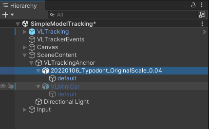
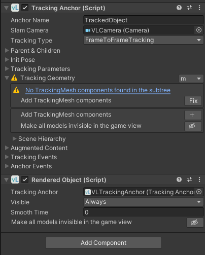
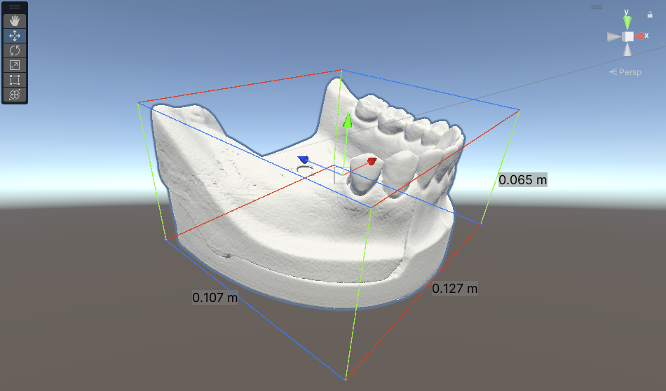
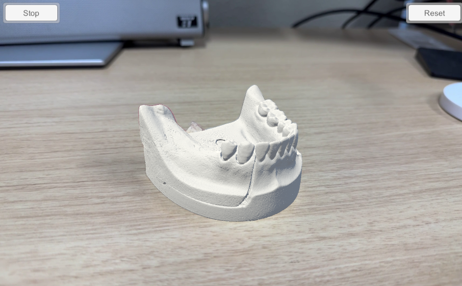

# モデルトラッキング

[導入](introduction.md) において、単純なモデルトラッキングができることを確認しました。本章ではモデルトラッキングについて、もう少し詳しい使い方を見ていきます。

**参考**

- [Model Tracking in Unity](https://docs.visionlib.com/v3.2.1/#/Using_VisionLib/Working_With_Unity/Model_Tracking_in_Unity/README)

## モデルの変更

SimpleModelTracking の MiniCar モデルを、歯列模型などの別のモデルに変更する方法を説明します。VisionLib の v2 系と v3 系では手順が大きくことなる点に注意してください。以下は v3.2.1 の手順となります。

1. `.obj` や `.stl` などの 3D モデルデータを `Assets` 内に読み込ませておく。
2. `Hierarchy` の `[SceneContent] -> [VLTrackingAnchor] -> [VLMiniCar]` を無効にする。
3. `[VLMiniCar]` と同じ階層に、用意した 3D モデルデータをドラッグ & ドロップする。
   
4. `[VLTrackingAnchor]` のインスペクタ上に `No TrackingMesh components found in the subtree` という警告が出るので、横にある `[Fix]`ボタンを押してトラッキング用のメッシュを追加する。
   
5. 3D モデルのスケールがおかしい場合は、`[TrackingAnchor] -> Tracking Geometory` で単位を変更するか、モデル自体のスケールを変更することで対応する。
   

以上のようにすることで、自分で用意した 3D モデルのトラッキングが可能になります。

安定したトラッキングのためには、初期ポーズ `(init pose)` の調整が必要になります。初期ポーズの設定方法については以下の公式ページで確認できます。

公式ページ：
[Setting an Init Pose](https://docs.visionlib.com/v3.2.1/#/Using_VisionLib/Working_With_Unity/Model_Tracking_in_Unity/SettingInitPose)

## 複数モデルを利用したオクルージョン

研究室ではオクルージョンを実現するために、3D モデルを複数用意して、マスク用のマテリアルを設定して、のようなことをしていました。しかし、公式で `DifferentAugmentation` というサンプルシーンがあり、以下の公式ページでオクルージョンの具体的な手順が説明されてもいたので、これを参考にすると良いかもしれません。

公式ページ：[Using Different Augmentation and Init Pose Guide](https://docs.visionlib.com/v3.2.1/#/Using_VisionLib/Working_With_Unity/Model_Tracking_in_Unity/DifferentAugmentationAndInitPoseGuide)

## AutoInit によるマルチモデルトラッキング (Beta)

VisionLib に搭載されたマルチモデルトラッキングの機能を使用するには、AutoInit と呼ばれる初期ポーズを自動で推定する機能を使用します（シングルモデルトラッキングでも本機能は使えそうです）。初期ポーズを固定しないことで、さまざまな角度からのトラッキング開始が可能となりますが、計算コストが高いことと、安定したトラッキング開始が難しくなる懸念があります。下記公式ページにもあるように β 版ということで、使用には注意が必要ですが、効果的に活用することで精度やユーザビリティが向上する可能性もあります。

公式ページ：
[AutoInit with WorkSpaces (Beta)](https://docs.visionlib.com/v3.2.1/#/Using_VisionLib/Working_With_Unity/Model_Tracking_in_Unity/AutoInitalization)
