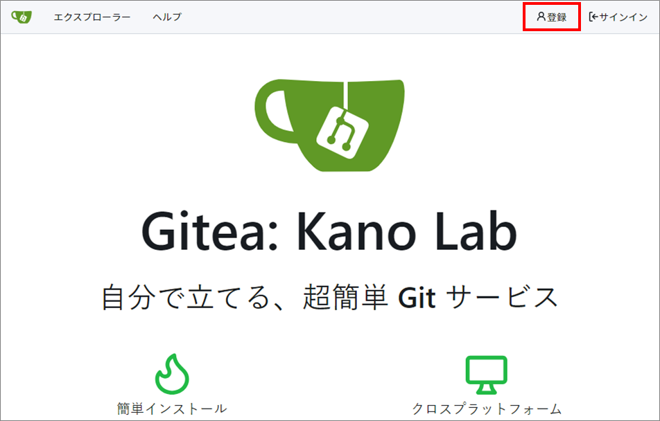
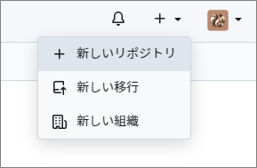
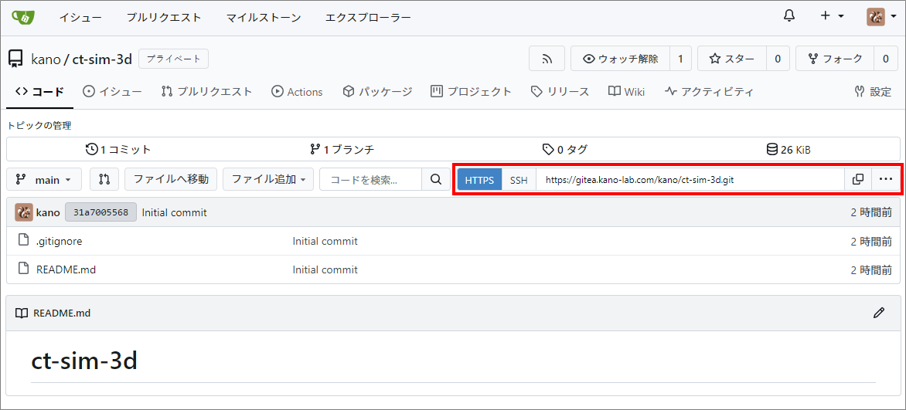
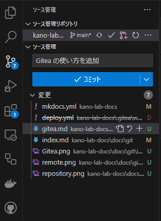

# Gitea の使い方

Gitea は超軽量なセルフホスト型の Git リポジトリ管理システムです。

加納研究室では Gitea ([https://gitea.kano-lab.com](https://gitea.kano-lab.com)) をセルフホストしています。

## アカウントの登録

まずは [Gitea](https://gitea.kano-lab.com) のページに行き、右上の「登録」ボタンを押し、必要事項を記入してアカウント登録をしてください。管理者（加納または院生）が確認後、アカウントのアクティベートを行います。



## リモートリポジトリの作成

リモートリポジトリ（プロジェクトのファイルや変更履歴を保存するリモート領域）を初めて作成する場合は、Gitea にログイン後、右上の「＋」アイコンをクリックし、「新しいリポジトリ」を選択します。



新しいリポジトリを作成する際、以下の情報を入力します。

- **オーナー**：リポジトリの所有者を選択します（通常は自分自身）。
- **リポジトリ名**：作成するリポジトリの名前を入力します。
- **公開/非公開**：リポジトリを「公開」（Public）または「非公開」（Private）に設定できます。研究関連のプロジェクトは、基本的には非公開に設定してください。
- **.gitignore**：追跡しないファイルのテンプレートを設定できます。特に Unity などのプロジェクトは、バージョン管理に不要なファイルやフォルダが多く存在するため、設定を忘れないようにしてください。

## ローカルリポジトリとリモートリポジトリのリンク

次に、Gitea で作成したリモートリポジトリをローカルのプロジェクトをリンクします。

以降のコマンドは、プロジェクトの階層でコマンドプロンプトや Git Bash を開くか、VS Code などで対象のプロジェクトを開き、ターミナルを表示させて実行します。VS Code にはデフォルトでリポジトリ管理やリモートリポジトリとの連携機能が搭載されているので、これらをうまく活用すると効率が上がります。

### 1. ローカルリポジトリの作成

まだローカルに Git リポジトリがない場合、プロジェクトのフォルダ内で以下のコマンドを実行して初期化します。

```
git init
```

また、以下の `checkout` コマンドによって、`main` ブランチを新しく作成しておきます。

```
git checkout -b main
```

### 2. リモートリポジトリをローカルに追加

リモートとローカルを連携させるために、以下のコマンドを実行してリモートリポジトリを追加します。

```
git remote add origin <リモートリポジトリのURL>
```

リモートリポジトリの URL は以下の画像の位置で確認できます。



### 3. リモートリポジトリの内容をローカルにフェッチ（任意）

初期設定で「.gitignore」や「README.md」を作成して、それを使用していく場合は、以下のコマンドを実行してリモートの内容をローカルに反映させます。

```
git pull origin main --allow-unrelated-histories
```

`--allow-unrelated-histories` オプションは、リモートリポジトリとローカルプロジェクトの履歴が異なる場合に必要なオプションです。

### 4. リポジトリにファイルを追加してプッシュ

ローカルのプロジェクトファイルおよび変更履歴をローカルリポジトリに追加/ステージング（add）・保存（commit）し、リモートリポジトリにアップロード（push）するには、以下のコマンドを順に実行します。コミットのコメントには、どのような変更を行ったかを簡潔に記載します（日本語でも OK）。

```
git add .
git commit -m "first commit"
git push -u origin main
```

初回の操作で、ファイル競合などの問題でリモートにファイルをアップロードできない場合は、以下のように `--force` オプションをつけて実行して下さい。

```
git push -u origin main --force
```

`push` する際にブラウザから Gitea との連携を求められた場合は、許可してください。

以上が、ローカルリポジトリとリモートリポジトリを連携する手順、およびプロジェクトのデータをアップロードする流れとなります。

**リモートリポジトリの URL にアクセスし、ファイルがアップロードされていれば成功です。**

以降も、`add`、`commit`、`push` の流れで同様にバージョン管理ができるようになります。

### VS Code によるバージョン管理

VS Code を使っている場合、左側のメニューに「ソース管理」があり、ここでリポジトリの管理や「コミット」「プッシュ」といった操作を行うこともできます。



## リモートリポジトリからローカルへのクローン

リモートリポジトリのファイルを、新しいローカル環境に入れる場合には、以下のコマンドを実行してリポジトリをクローンします。

```
git clone  <リモートリポジトリのURL>
```

## リモートリポジトリからローカルへの変更反映

リモートリポジトリに行った変更を、別の場所で反映させたい場合には、以下のように `pull` コマンドを実行します。

```
git pull origin main --rebase
```

このコマンドによって、以下の操作が行われます。

- リモートリポジトリの `main` ブランチの最新の変更がローカルにフェッチ（取得）されます。
- ローカルの変更が一旦取り外されます、
- リモートの変更に基づいてローカルの変更が再適用されます。

`--rebase` オプションを付けることで、上記のように履歴の枝分かれが起こらず、一貫した履歴管理が可能になるため、基本的にはつけることを推奨します。

### `--rebase` で競合が発生した場合

リベースの操作中に競合が発生してしまった場合は、手動で競合を解消し、`git rebase --continue` コマンドでリベースを続行する必要があります。手順は以下のようになります。

#### 1. 競合内容を確認し、解消

#### 2. 変更されたファイルをステージング

```
git add <File>
```

#### 3. リベースを続行

```
git rebase --continue
```

#### 4. 強制プッシュ

```
git push --force
```

<br>
