Java で画像処理を行うための開発環境を構築しましょう。
本資料ページでは、Java の統合開発環境に、Java 提供元である Oracle 公式の NetBeans を用います。
NetBeans は、優れた GUI デザイナを標準で搭載し、簡単にアプリケーションの UI を設計することができる特徴を持ちます。

## 1. JDK (Java SE Development Kit) のインストール

まずは、Java の開発を行うための開発キット、JDK をダウンロード & インストールします。
下記のリンクから、使用中の OS に合わせた LTS (Long-term Support) の JDK を入手しましょう。Windows の場合はタブを [Windows] に切り替え、[x64 Installer] または [x64 MSI Installer] をダウンロードしてインストールしてください。  
[https://www.oracle.com/java/technologies/downloads/](https://www.oracle.com/java/technologies/downloads/)

※ 2024/05/10 時点での LTS 最新版は 21.0.3

x64 Installer 版（jdk-21_windows-x64_bin.exe）を実行すると、次のような JDK セットアップウィザードが立ち上がるので、「次(N) >」ボタンを押します。

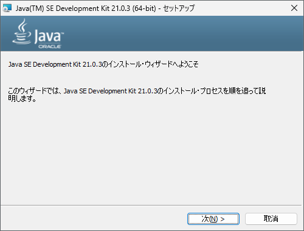

インストールフォルダを聞かれますが、特にこだわりがなければそのまま「次(N) >」ボタンを押します。

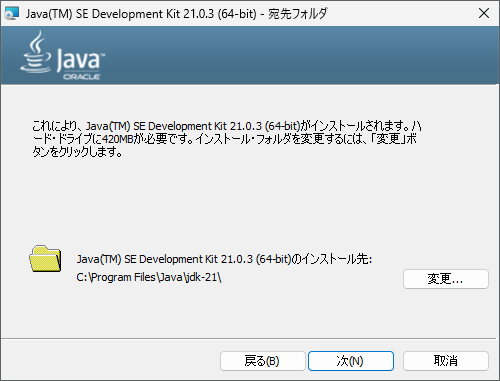

しばらくすると JDK のインストールが完了します。

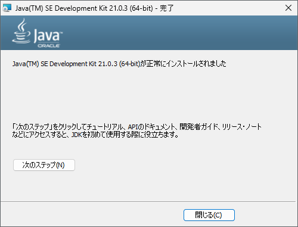

## 2. NetBeans のインストール

次に、下記リンクから Java の統合開発環境である NetBeans をダウンロード & インストールします。
[Download] → [Installers and Packages] から OS に合ったインストーラを入手しましょう。
[https://netbeans.apache.org/front/main/download/](https://netbeans.apache.org/front/main/download/)

- Windows であれば [Apache-NetBeans-21-bin-windows-x64.exe]
- Mac であれば [Apache-NetBeans-21.pkg]

※ 2024/05/10 時点での最新版は 21

Windows の NetBeans インストーラを実行すると、次のようなセットアップウィザードが立ち上がり、インストールするランタイムの確認が行われます。

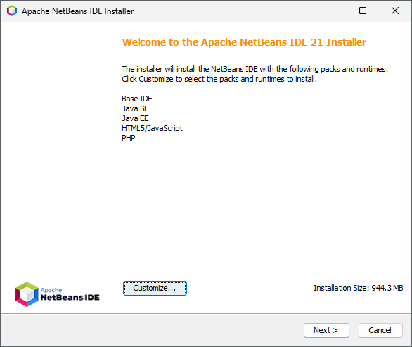

このままでも問題はありませんが、インストールサイズが気になるようであれば、[Customize...] から [Java EE] と [PHP] のチェックを外してください（本サイトおよび加納研究室では扱いません）。

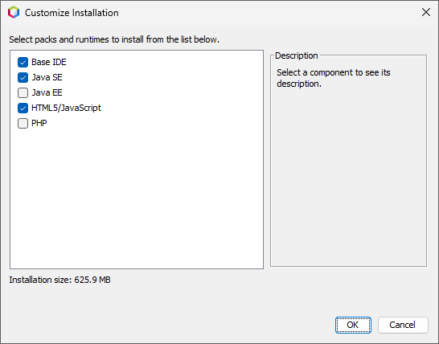

「OK」ボタンを押すと、ライセンス契約の確認画面になります。  
確認後、チェックボックスにチェックを入れて「Next >」ボタンを押します。

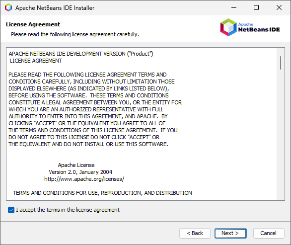

NetBeans のインストール先と、利用する JDK のパスが表示されます。  
先ほどインストールされた JDK が正しく表示されていることを確認してください。  
問題がなければ「Next >」ボタンを押します。

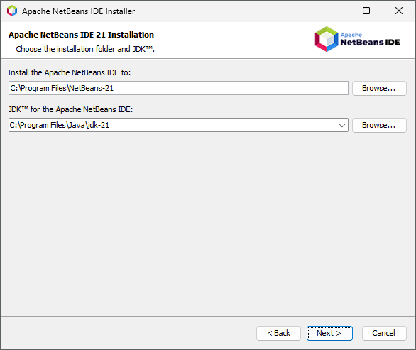

インストール確認画面です。  
「Install」ボタンを押すと、NetBeans のインストールがはじまります。  
「Check for updates」は、初回起動時に誤作動を起こす可能性があるので、チェックを外しておくことをおすすめします。

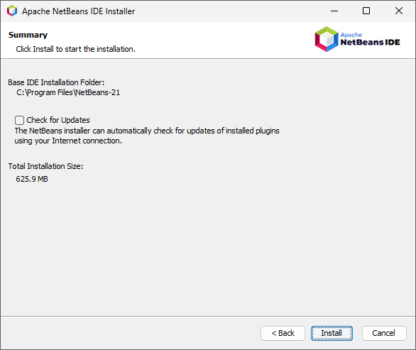

インストールが完了したら「Finish」ボタンを押して、ウィザードを閉じてください。

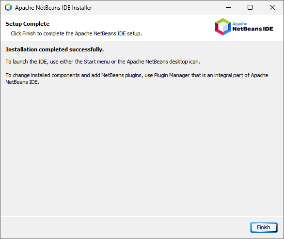

## 3. NetBeans の初期設定

デスクトップのアイコンやスタートメニューから NetBeans を立ち上げ、簡単に初期設定を行っておきましょう。

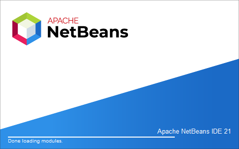

NetBeans が立ち上がると、以下のような画面になります。

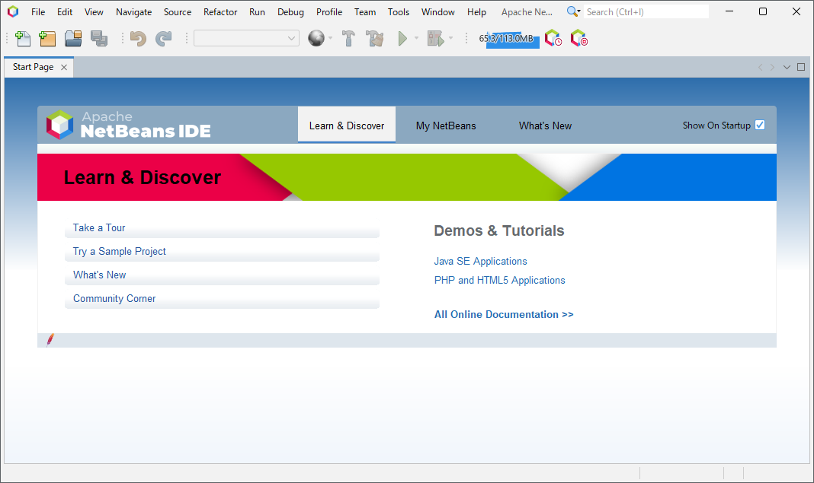

### 日本語化

IDE 全体を日本語化したい場合、非公式となりますが、以下のリポジトリで配布されている nbm ファイルを利用することができます。

[https://github.com/junichi11/netbeans-translations-ja](https://github.com/junichi11/netbeans-translations-ja)

まずは [Releases](https://github.com/junichi11/netbeans-translations-ja/releases) から
[org-apache-netbeans-localise-ja-0.0.4.nbm] をダウンロードします。  
※ 2024/05/10 時点での最新版は 0.0.4

NetBeans のメニューバーから、[Tools] :material-arrow-right: [Plugins] と進みます。

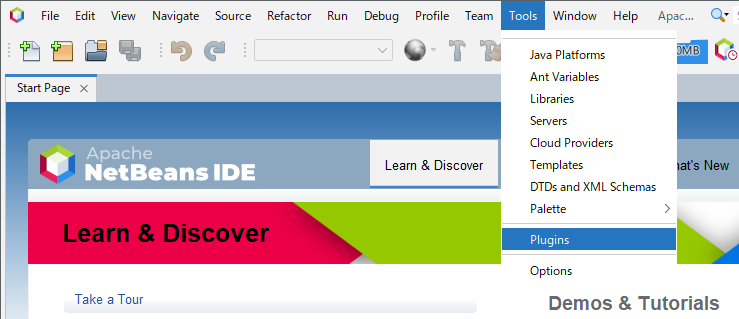

タブを [Donloaded] に切り替え、[Add Plugins...] ボタンを押し、先ほどダウンロードした nbm ファイルを読み込ませます。チェックを入れて [Install] ボタンを押すと、インストールがはじまります。

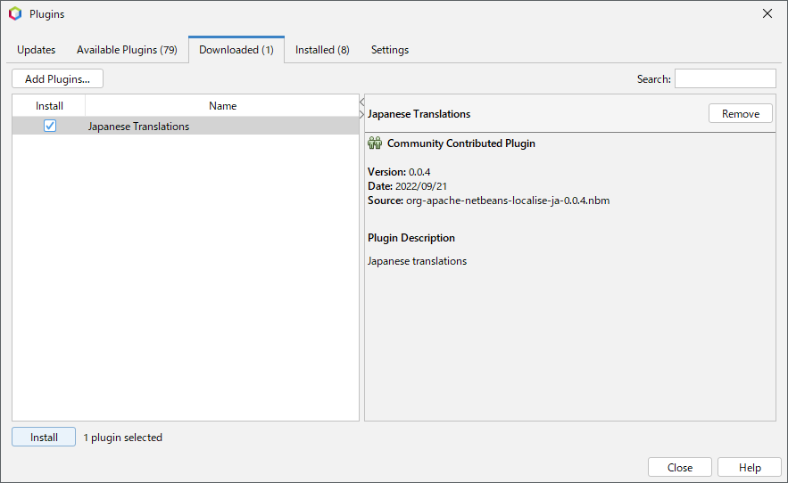

NetBeans を再起動すると、画面全体が日本語化されているはずです。

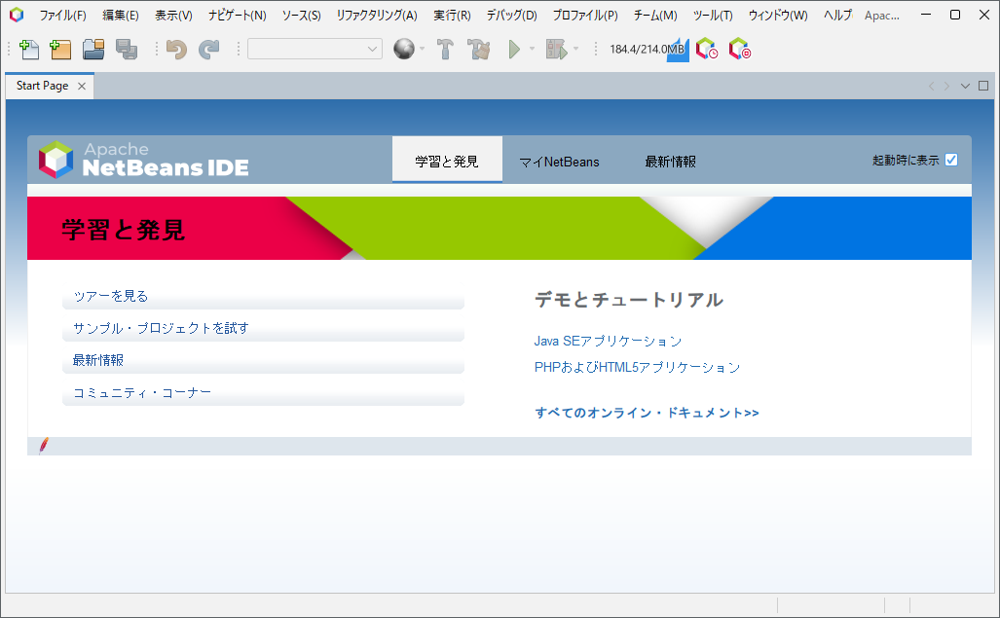

### フォントの変更

デフォルトのフォントは「Monospaced」となっていますが、あまり見やすくないため、まずはフォントを変更することを推奨します。

まずはメニューバーから [ツール] :material-arrow-right: [オプション] と進み、「オプション」ウィンドウを出します。

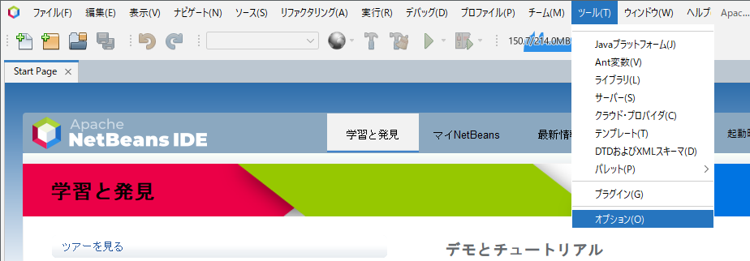

[フォントと色] タブで、好みのフォントに変更をすることができます。

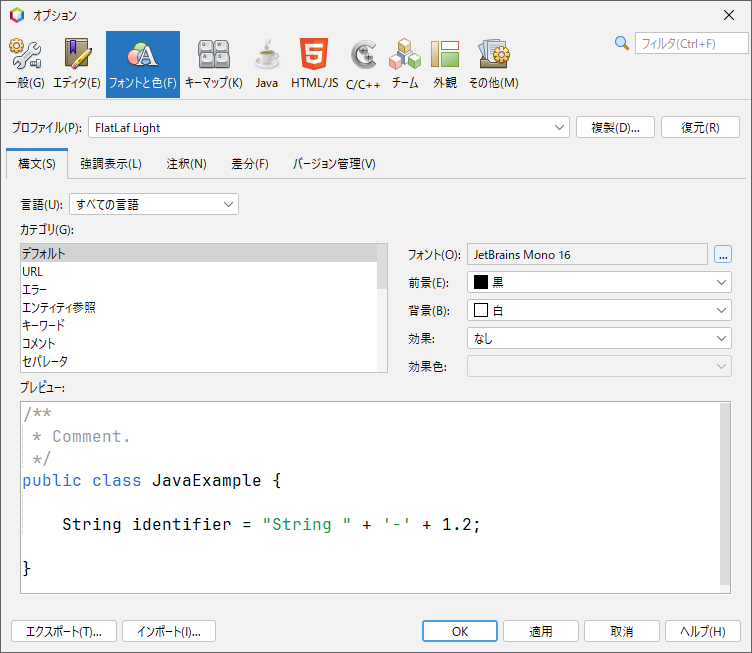

!!! warning "「フォントと色」タブが表示されない場合"

    NetBeans をインストールしたばかりでエディタの機能がアクティブになっていない場合、[フォントと色] タブが表示されないかもしれません。

    その場合、一度 Java SE プロジェクトを新規作成するか、[ツール] :material-arrow-right: [プラグイン] :material-arrow-right: [インストール済] と進み、[Java SE] をアクティブ化してください。

プログラミング用のフォントはさまざま存在しますが、ここでは

- [UDEV Gothic](https://github.com/yuru7/udev-gothic)
- [Ricty Diminished](https://github.com/edihbrandon/RictyDiminished)

の 2 つをおすすめしておきます。

併せて、出力ウィンドウやターミナルのフォントも変更しておくことを推奨します。「オプション」ウィンドウの [その他] :material-arrow-right: [出力] / [ターミナル] からフォントを変更できます。

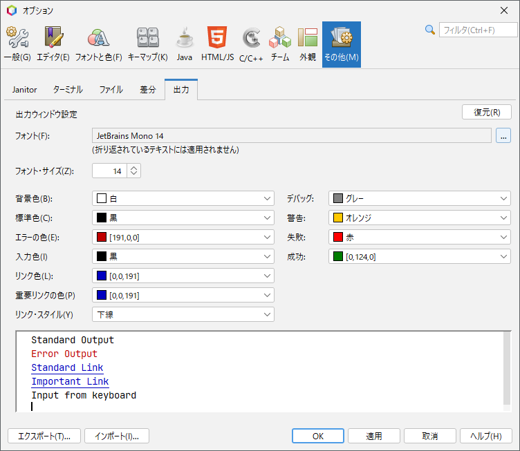

 
