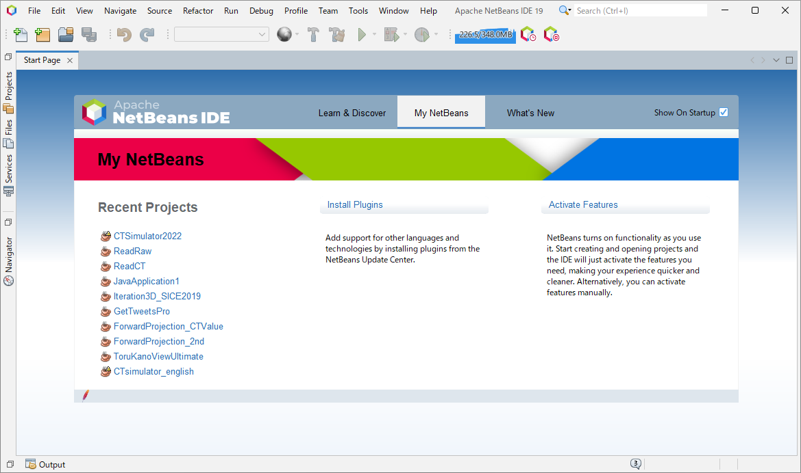
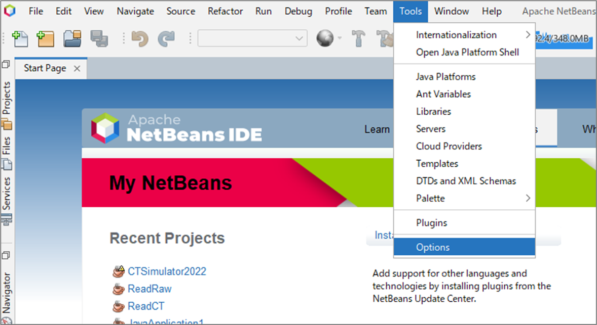
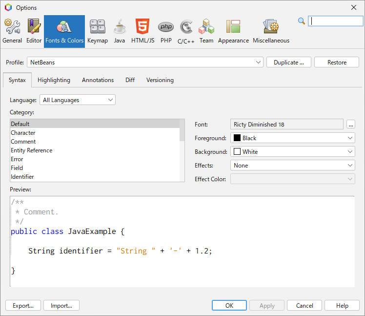
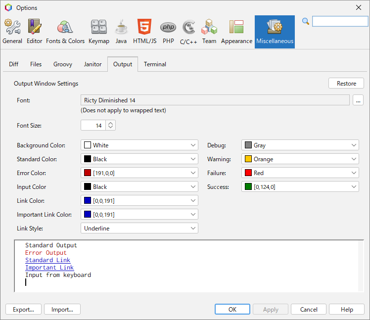

Java で画像処理を行うための開発環境を構築しましょう。
本資料ページでは、Java の統合開発環境に、Java 提供元である Oracle 公式の NetBeans を用います。
NetBeans は、優れた GUI デザイナを標準で搭載し、簡単にアプリケーションの UI を設計することができる特徴を持ちます。

## 1. JDK (Java SE Development Kit) のインストール

まずは、Java の開発を行うための開発キット、JDK をダウンロード & インストールします。
下記のリンクから、使用中の OS に合わせた LTS (Long-term Support) の JDK を入手しましょう。  
[https://www.oracle.com/java/technologies/downloads/](https://www.oracle.com/java/technologies/downloads/)

※ 2023/12/01 時点での LTS 最新版は 21.0.1

## 2. NetBeans のインストール

次に、下記リンクから Java の統合開発環境である NetBeans をダウンロード & インストールします。
[Download] → [Installers and Packages] から OS に合ったインストーラを入手しましょう。
[https://netbeans.apache.org/front/main/download/](https://netbeans.apache.org/front/main/download/)

- Windows であれば [Apache-NetBeans-19-bin-windows-x64.exe]
- Mac であれば [Apache-NetBeans-19.pkg]

※ 2023/12/01 時点での最新版は 19

## 3. NetBeans の初期設定

NetBeans を立ち上げると、以下のような画面になります。

### フォントの変更

デフォルトのフォントは「Monospaced」となっていますが、見にくいのでまずはフォントを変更することを推奨します。

メニューバーの [Tool] → [Options] と進み Options ウィンドウを出し、[Fonts & Colors] タブでフォントの変更をすることができます。

プログラミング用のフォントはさまざま存在しますが、ここでは [Ricty Diminished](https://github.com/edihbrandon/RictyDiminished) をおすすめしておきます。

併せて、出力ウィンドウのフォントも変更しておくことを推奨します。Options ウィンドウの [Miscellaneous] → [Output] からフォントを変更できます。

