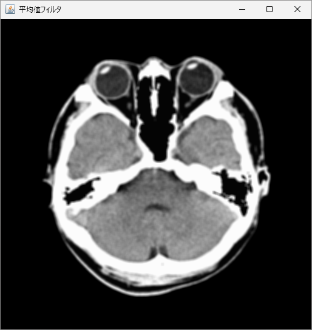
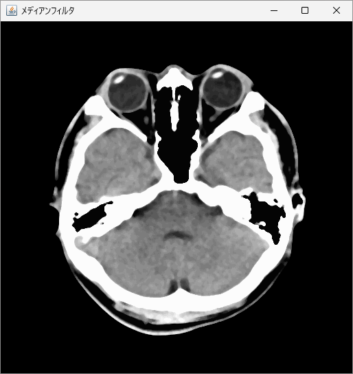
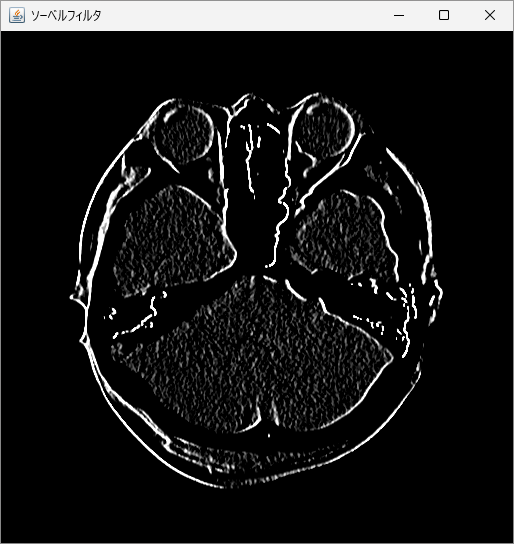
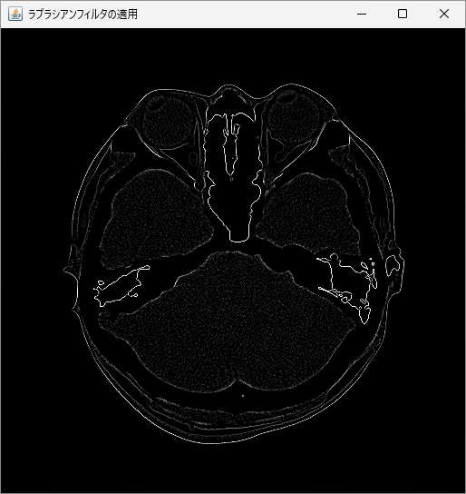
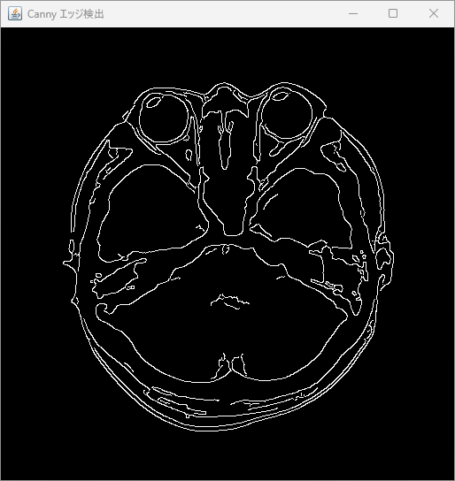
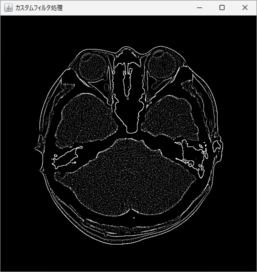

画像処理におけるフィルタ処理は、ノイズの除去、エッジ検出、特徴強調など、画像の品質を改善するために不可欠な技術です。
このセクションでは、基本的なフィルタ処理について、Java と OpenCV を利用して実装する方法を学びます。

## フィルタの種類

フィルタには以下のようなさまざまなものがありますが、多くはフィルタ（カーネル）の形が異なるだけで、基本的な考え方は同じです。画像に対して予め決められたフィルタでコンボリューション（畳み込み）演算することを**線形フィルタ処理**、単純な線形演算によらないものを**非線形フィルタ処理**と呼びます。以下のフィルタ例では、「メディアンフィルタ」「バイラテラルフィルタ」が非線形フィルタに分類されます。

**平滑化フィルタ**

- 平均値（加重平均）フィルタ
- ガウシアンフィルタ
- メディアンフィルタ

**鮮鋭化フィルタ**

- ソーベルフィルタ
- ラプラシアンフィルタ

**その他のフィルタ**

- バイラテラルフィルタ

## 平滑化フィルタ

平滑化フィルタ処理はブラー処理とも呼ばれ、指定したフィルタで画像を滑らかにする処理を行います。

### 平均値フィルタ

最も単純な平滑化フィルタである平均値フィルタは、指定されたカーネルサイズに基づいて、周囲の画素の平均値に現在の画素を置き換えます。平均値フィルタは `Imgproc.blur` メソッドによって適用することができます。第 1 引数には入力画像、第 2 引数には出力画像、第 3 引数にはカーネルサイズを指定します。以下は、`5 x 5` のカーネルサイズの平均値フィルタを適用するコード例です。

```java
// ライブラリの読み込み
System.loadLibrary(Core.NATIVE_LIBRARY_NAME);

// 画像の読み込み
Mat image = Imgcodecs.imread("KanoHead.png", Imgcodecs.IMREAD_GRAYSCALE);

// 平均値フィルタの適用
Mat filteredImage = new Mat();
Imgproc.blur(image, filteredImage, new Size(5, 5));

// 画像の表示
HighGui.imshow("平均値フィルタ", filteredImage);
HighGui.waitKey();
System.exit(0);
```



### ガウシアンフィルタ

ガウシアンフィルタは、ガウス分布を使用して周囲の画素の加重平均を計算します。
これにより、単純な平均値フィルタよりも自然なぼかしを生成ことができます。
ガウシアンフィルタは、`Imgproc.GaussianBlur` メソッドによって適用することができます。
第 1 引数には入力画像、第 2 引数には出力画像、第 3 引数にはカーネルサイズ、第 4 引数にはガウス分布の標準偏差の値を指定します。標準偏差の値は大きくするほどぼけの強度が高くなるもので、`-1` を指定するとカーネルサイズから自動的に計算されます。以下は、ガウシアンフィルタを適用するコード例です。

```java
// ライブラリの読み込み
System.loadLibrary(Core.NATIVE_LIBRARY_NAME);

// 画像の読み込み
Mat image = Imgcodecs.imread("KanoHead.png", Imgcodecs.IMREAD_GRAYSCALE);

// ガウシアンフィルタの適用
Mat filteredImage = new Mat();
Imgproc.GaussianBlur(image, filteredImage, new Size(15, 15), -1);

// 画像の表示
HighGui.imshow("ガウシアンフィルタ", filteredImage);
HighGui.waitKey();
System.exit(0);
```


### メディアンフィルタ

メディアン（中央値）フィルタは、周囲の画素値の中央値を現在のピクセル値と置き換える処理を行います。
このフィルタは特に、ごま塩ノイズの除去に効果的であることが知られています。
メディアンフィルタは、`Imgproc.medialBlur` メソッドによって適用することができます。
第 1 引数には入力画像、第 2 引数には出力画像、第 3 引数にはカーネルサイズ（奇数の整数値）を指定します。以下は、メディアンフィルタを適用するコード例です。

```java
// ライブラリの読み込み
System.loadLibrary(Core.NATIVE_LIBRARY_NAME);

// 画像の読み込み
Mat image = Imgcodecs.imread("KanoHead.png", Imgcodecs.IMREAD_GRAYSCALE);

// メディアンフィルタの適用
Mat filteredImage = new Mat();
Imgproc.medianBlur(image, filteredImage, 5);

// 画像の表示
HighGui.imshow("メディアンフィルタ", filteredImage);
HighGui.waitKey();
System.exit(0);
```



## 鮮鋭化フィルタ

鮮鋭化フィルタは、エッジ検出や画像特徴の強調に利用されるフィルタです。
基本的な原理は、画素の明るさの勾配を計測し、特定のしきい値以上の勾配をエッジとして検出または強調させるというものです。

### ソーベルフィルタ

ソーベルフィルタは、水平方向や垂直方向のエッジを検出するのに適しています。
ソーベルフィルタは `Imgproc.Sobel` メソッドによって適用できます。
第 1 引数には入力画像、第 2 引数には出力画像、第 3 引数には画像のビット深度、第 4 引数には x 方向の微分次数、第 5 引数には y 方向の微分次数を指定します。以下は、ソーベルフィルタを適用するコード例です。

```java
// ライブラリの読み込み
System.loadLibrary(Core.NATIVE_LIBRARY_NAME);

// 画像の読み込み
Mat image = Imgcodecs.imread("KanoHead.png", Imgcodecs.IMREAD_GRAYSCALE);

// ソーベルフィルタの適用
Mat filteredImage = new Mat();
Imgproc.Sobel(image, filteredImage, image.type(), 1, 0);

// 画像の表示
HighGui.imshow("ソーベルフィルタ", filteredImage);
HighGui.waitKey();
System.exit(0);
```



### ラプラシアンフィルタ

ラプラシアンフィルタは、二次微分フィルタとも呼ばれ、画像の二次微分がゼロを通過する点をエッジとして検出します。
ラプラシアンフィルタは `Imgproc.Laplacian` メソッドによって適用できます。
第 1 引数には入力画像、第 2 引数には出力画像、第 3 引数には画像のビット深度を指定します。以下は、ラプラシアンフィルタを適用するコード例です。

```java
// ライブラリの読み込み
System.loadLibrary(Core.NATIVE_LIBRARY_NAME);

// 画像の読み込み
Mat image = Imgcodecs.imread("KanoHead.png", Imgcodecs.IMREAD_GRAYSCALE);

// ラプラシアンフィルタの適用
Mat filteredImage = new Mat();
Imgproc.Laplacian(image, filteredImage, image.type());

// 画像の表示
HighGui.imshow("ラプラシアンフィルタの適用", filteredImage);
HighGui.waitKey();
System.exit(0);
```



### Canny エッジ検出

Canny エッジ検出は、ノイズが多い画像でも精度良くエッジを検出することができる高度な方法です。
エッジ検出において非常に高い信頼性を持ち、高速かつ明瞭で連続性のあるエッジを生成することができることから、今日でもさまざまなアプリケーションで利用されています。
Canny エッジ検出は、`Imgproc.Canny` メソッドによって適用できます。
第 1 引数には入力画像、第 2 引数には出力画像、第 3 引数にはエッジと判定するしきい値の下限、第 4 引数にはエッジと判定するしきい値の上限を指定します。また、Canny エッジ検出は、ガウシアンフィルタなどの平滑化フィルタと併用することで、高い効果を発揮します。以下は、Canny エッジ検出を適用するコード例です。

```java
// ライブラリの読み込み
System.loadLibrary(Core.NATIVE_LIBRARY_NAME);

// 画像の読み込み
Mat image = Imgcodecs.imread("KanoHead.png", Imgcodecs.IMREAD_GRAYSCALE);

// ガウシアンフィルタの適用
Mat bluredImage = new Mat();
Imgproc.GaussianBlur(image, bluredImage, new Size(5, 5), -1);

// Canny エッジ検出
Mat filteredImage = new Mat();
Imgproc.Canny(bluredImage, filteredImage, 100, 200);

// 画像の表示
HighGui.imshow("Canny エッジ検出", filteredImage);
HighGui.waitKey();
System.exit(0);
```



## その他のフィルタ

OpenCV にはその他にもさまざまなフィルタが利用可能となっています。

### バイラテラルフィルタ

バイラテラルフィルタは、エッジの情報を保つながら、平滑化を行う非線形フィルタであり、空間的な近さと画素値の類似性の両方に基づいて重み付けを行います。
ノイズを効果的に除去しつつ、重要な構造的特徴を鮮明にすることが可能である特徴から、さまざまな応用分野で使用されています。
バイラテラルフィルタは、`Imgproc.bilateralFilter` メソッドによって適用できます。
第 1 引数には入力画像、第 2 引数には出力画像、第 3 引数にはフィルタの直径、第 4 引数には色空間の標準偏差、第 5 引数には座標空間の標準偏差を指定します。以下は、バイラテラルフィルタを適用するコード例です。

```java
// ライブラリの読み込み
System.loadLibrary(Core.NATIVE_LIBRARY_NAME);

// 画像の読み込み
Mat image = Imgcodecs.imread("KanoHead.png", Imgcodecs.IMREAD_GRAYSCALE);

// バイラテラルフィルタの適用
Mat filteredImage = new Mat();
Imgproc.bilateralFilter(image, filteredImage, 10, 50, 50);

// 画像の表示
HighGui.imshow("バイラテラルフィルタ", filteredImage);
HighGui.waitKey();
System.exit(0);
```


### 任意の線形フィルタ

OpenCV にはさまざまなプリセットフィルタが利用可能になっていますが、自分でフィルタを設計することもできます。
自作した `Mat` オブジェクトの線形フィルタは、`filter2D` メソッドによって適用することができます。
第 1 引数には入力画像、第 2 引数には出力画像、第 3 引数には出力画像のビット深度（入力画像と同じ場合は `-1`）、第 4 引数にはフィルタを指定します。以下は、`3 x 3` の 8 近傍ラプラシアンフィルタ（カーネル）を自作し、適用するコード例です。

```java
// ライブラリの読み込み
System.loadLibrary(Core.NATIVE_LIBRARY_NAME);

// 画像の読み込み
Mat image = Imgcodecs.imread("KanoHead.png", Imgcodecs.IMREAD_GRAYSCALE);

// カーネルの作成（8近傍ラプラシアンフィルタ）
Mat kernel = new Mat(3, 3, CvType.CV_32F) {
    {
        put(0, 0, 1);
        put(0, 1, 1);
        put(0, 2, 1);
        put(1, 0, 1);
        put(1, 1, -8);
        put(1, 2, 1);
        put(2, 0, 1);
        put(2, 1, 1);
        put(2, 2, 1);
    }
};
// カスタムフィルタ処理
Mat filteredImage = new Mat();
Imgproc.filter2D(image, filteredImage, -1, kernel);

// 画像の表示
HighGui.imshow("カスタムフィルタ処理", filteredImage);
HighGui.waitKey();
System.exit(0);
```



<br>
