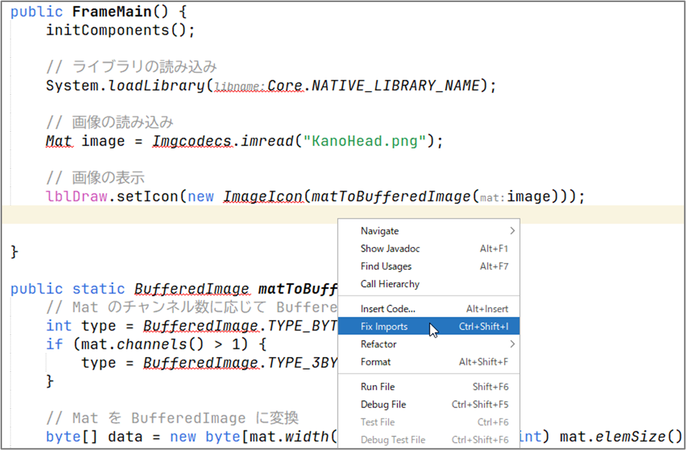

# OpenCV での画像の読み込みと表示

このセクションでは Java を使用して OpenCV で画像を読み込み、表示する基本的な方法を学んでいきます。

## OpenCV ライブラリのインポート

通常、以下のような import 文で OpenCV ライブラリをインポートします。

```java
import org.opencv.core.Core;
import org.opencv.core.Mat;
import org.opencv.imgcodecs.Imgcodecs;
```

これにより、画像データを表す `Mat` クラスや画像の読み書きを行う `Imgcodecs` クラスなど、必要な OpenCV の機能にアクセスできるようになります。

## OpenCV による画像の読み込み

Java で OpenCV を使って画像を読み込む場合、`Imgcodecs` クラスの `imread` メソッドを使用します。これは指定されたパスにある画像ファイルを読み込み、`Mat` オブジェクトとして返す機能を持っています。

以下に、読み込みの基本的なコードを示します。

```java
System.loadLibrary(Core.NATIVE_LIBRARY_NAME);
String imageFilePath = "./image.png";
Mat image = Imgcodecs.imread(imageFilePath);
```

`System.loadLibrary(Core.NATIVE_LIBRARY_NAME);` によって、OpenCV のネイティブライブラリが読み込まれます。
これはプログラムの開始時に一度だけ実行すれば OK です。

### 頭部 CT 画像（フリー素材）

以下では私の頭部 CT 画像（KanoHead.png、フリー素材）を使っていくことにします。


## OpenCV による画像の表示

OpenCV 単体でも、[`HighGui`](https://docs.opencv.org/4.x/javadoc/org/opencv/highgui/HighGui.html) クラスを用いることで、簡易的に画像の表示を行うことができます。
本サイトのサンプルコードでは、記述をシンプルにするために基本的には [`HighGui`](https://docs.opencv.org/4.x/javadoc/org/opencv/highgui/HighGui.html) クラスを用いることにしますが、高度な GUI アプリケーションを作成する場合は、Swing などの GUI フレームワークを併用するようにしてください。

[`HighGui`](https://docs.opencv.org/4.x/javadoc/org/opencv/highgui/HighGui.html) クラスを用いた画像の表示は、[`imshow`](<https://docs.opencv.org/4.x/javadoc/org/opencv/highgui/HighGui.html#imshow(java.lang.String,org.opencv.core.Mat)>) メソッドで行い、直後に [`waitKey`](<https://docs.opencv.org/4.x/javadoc/org/opencv/highgui/HighGui.html#waitKey()>) メソッドを置くことで、ウィンドウを表示させることができます。以下は実際のコード例です。

```java
import org.opencv.core.Core;
import org.opencv.core.Mat;
import org.opencv.highgui.HighGui;
import org.opencv.imgcodecs.Imgcodecs;

public class Main {
    public static void main(String[] args) {
        // ライブラリの読み込み
        System.loadLibrary(Core.NATIVE_LIBRARY_NAME);

        // 画像の読み込み
        Mat image = Imgcodecs.imread("KanoHead.png");

        // 画像の表示
        HighGui.imshow("HighGui による画像の表示", image);
        HighGui.waitKey();
        System.exit(0);
    }
}
```

以下のようなウィンドウが表示されたら成功です。


## Swing による画像の表示

実際の Java アプリケーション開発においては、Swing などの GUI フレームワークを使用するのが一般的です。
そのため、画像を表示するためのウィンドウを作成し、そこに画像を描画する必要があります。

以下では、NetBeans の GUI デザイナを使用している想定で話を進めていきます。
いつものように、`JFrame` フォームを作成し、そこに `JLabel` コンポーネントを貼り付けましょう。
`JFrame` の名前は `FrameMain`、`JLabel` の名前は `lblDraw`、サイズは `512 x 512` としています。


### JLabel への画像表示

NetBeans で `JFrame` フォームを作成すると、コンストラクタの中に GUI の描画を行う `initComponents` メソッドが生成されます。この後ろに、OpenCV の簡単なコードを書いてみましょう。

```java
initComponents();   // 最初から含まれているコード

// ライブラリの読み込み
System.loadLibrary(Core.NATIVE_LIBRARY_NAME);

// 画像の読み込み
Mat image = Imgcodecs.imread("KanoHead.png");

// 画像の表示
lblDraw.setIcon(new ImageIcon(HighGui.toBufferedImage(image)));
```

ここで `toBufferedImage` は `Mat` を `BufferedImage` に変換するメソッドで、中身は以下のようになっています。

```java
public static Image toBufferedImage(Mat m) {
    int type = BufferedImage.TYPE_BYTE_GRAY;

    if (m.channels() > 1) {
        type = BufferedImage.TYPE_3BYTE_BGR;
    }

    int bufferSize = m.channels() * m.cols() * m.rows();
    byte[] b = new byte[bufferSize];
    m.get(0, 0, b); // get all the pixels
    BufferedImage image = new BufferedImage(m.cols(), m.rows(), type);

    final byte[] targetPixels = ((DataBufferByte) image.getRaster().getDataBuffer()).getData();
    System.arraycopy(b, 0, targetPixels, 0, b.length);

    return image;
}
```

ここまでのコードを記述すると、シンボルが見つからないというエラーが出ているかもしれません。
このエラーを解消するためには、コードエディタの好きな場所で右クリックをし、[Fix Imports]（インポートの修正）を行ってください。



するとコードが解析され、以下のように必要な `import` 文が自動挿入されます。

```java
import java.awt.image.BufferedImage;
import java.awt.image.DataBufferByte;
import javax.swing.ImageIcon;
import org.opencv.core.Core;
import org.opencv.core.Mat;
import org.opencv.highgui.HighGui;
import org.opencv.imgcodecs.Imgcodecs;
```

エラーが解消されたらコードを実行してみましょう。


ウィンドウが立ち上がり、画像が表示されたら成功です。

## 各種データの変換

前節では、`Mat` オブジェクトを `BufferedImage` に変換する方法を紹介しました。
その他にも、プログラムを書いているとさまざまな変換が必要になることが考えられます。
ここでは、幾つかのデータ変換の方法を整理して紹介します。

### 配列から Mat への変換

二次元情報が格納された配列（構造自体は一次元）を `Mat` に変換したい場合は、`Mat` のインスタンスを生成し、`put` メソッドを用いて情報を格納します。以下はコード例です。

```java
Mat mat = new Mat(rows, cols, type);
mat.put(row, col, array);
```

`Mat` のコンストラクタは幾つかの種類がありますが、ここでは行数（rows）、列数（cols）、種類（type）を指定しています。
行数は画像の高さ、列数は画像の幅に相当する点に注意してください。
`put` メソッドでは、データを流し込む行と列の開始位置、および配列（array）を渡しています。
以下は実際のコード例です。

```java
Mat mat = new Mat(512, 512, CvType.CV_8U);
mat.put(0, 0, grayData);
```

この例では、解像度 `512x512`、8 ビットグレースケールの `Mat` オブジェクトを作成し、
そこに `grayData` という名前の配列（これは別途自分で用意）を格納しています。
type の例を以下に幾つか示します。

- `CvType.CV_8U` : 8 ビットグレースケール
- `CvType.CV_8UC3` : 8 ビットカラー
- `CvType.CV_16U` : 16 ビットグレースケール
- `CvType.CV_16UC3` : 16 ビットカラー
- `CvType.CV_32F` : 32 ビットグレースケール（浮動小数点数）
- `CvType.CV_32FC3` : 32 ビットカラー（浮動小数点数）

### Mat から配列への変換

`Mat` から配列にデータを格納したい場合は、`get` メソッドを使用します。
以下は、`CvType.CV_32F` の `Mat` オブジェクトを、float の配列に格納するコード例です。

```java
float[] imgData = new float[dataWidth * dataHeight];
rotated.get(0, 0, imgData);
```

### BufferedImage から Mat への変換

`BufferedImage` から `Mat` に変換するには、`BufferedImage` の情報をデータ配列に変換し、`put` メソッドを適用します。
以下は関数のコード例です。

```java
public Mat bufferedImageToMat(BufferedImage bi) {
    Mat mat = new Mat(bi.getHeight(), bi.getWidth(), CvType.CV_8UC3);
    byte[] data = ((DataBufferByte) bi.getRaster().getDataBuffer()).getData();
    mat.put(0, 0, data);
    return mat;
}
```

### Mat から BufferedImage への変換

`Mat` から `BufferedImage` に変換する方法は、前述のとおり、`HighGui.toBufferedImage` メソッドを使うのが簡単です。以下はコード例です。

```java
Mat mat = Imgcodecs.imread("KanoHead.png");
BufferedImage bi = HighGui.toBufferedImage(mat);
```

## まとめ

このセクションでは、OpenCV を用いて Java で画像を読み込み、表示・変換する方法について学びました。
以降のセクションでは、OpenCV による具体的な画像処理の方法について見ていきます。

<br>
