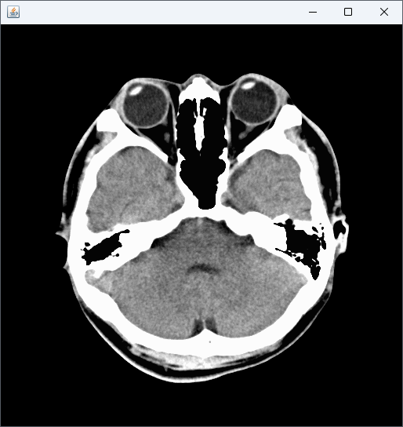

# OpenCV での画像の読み込みと表示

このセクションでは Java を使用して OpenCV で画像を読み込み、表示する基本的な方法を学んでいきます。

## OpenCV ライブラリのインポート

通常、以下のような import 文で OpenCV ライブラリをインポートします。

```java
import org.opencv.core.Core;
import org.opencv.core.Mat;
import org.opencv.imgcodecs.Imgcodecs;
```

これにより、画像データを表す `Mat` クラスや画像の読み書きを行う `Imgcodecs` クラスなど、必要な OpenCV の機能にアクセスできるようになります。

## OpenCV を使った画像の読み込み

Java で OpenCV を使って画像を読み込む場合、`Imgcodecs` クラスの `imread` メソッドを使用します。これは指定されたパスにある画像ファイルを読み込み、`Mat` オブジェクトとして返す機能を持っています。

以下に読み込みの基本的なコードを示します。

```java
System.loadLibrary(Core.NATIVE_LIBRARY_NAME);
String imageFilePath = "./image.png";
Mat image = Imgcodecs.imread(imageFilePath);
```

`System.loadLibrary(Core.NATIVE_LIBRARY_NAME);` によって、OpenCV のネイティブライブラリが読み込まれます。
これはプログラムの開始時に一度だけ実行すれば OK です。

## OpenCV を使った画像の表示

OpenCV 単体でも画像の表示は可能ですが、Swing などの Java の GUI フレームワークを使用するのが一般的です。
そのため、画像を表示するためのウィンドウを作成し、そこに画像を描画する必要があります。

以下では、NetBeans の GUI デザイナを使用している想定で話を進めていきます。
いつものように、`JFrame` フォームを作成し、そこに `JLabel` コンポーネントを貼り付けましょう。
`JFrame` の名前は `FrameMain`、`JLabel` の名前は `lblDraw`、サイズは `512 x 512` としています。


### 頭部 CT 画像（フリー素材）

表示する画像は何でも構いませんが、ここでは以下の私の頭部 CT 画像（KanoHead.png、フリー素材）を使っていくことにします。


### JLabel への画像表示

NetBeans で `JFrame` フォームを作成すると、コンストラクタの中に GUI の描画を行う `initComponents` メソッドが生成されます。この後ろに、OpenCV の簡単なコードを書いていきましょう。

```java
initComponents();   // 最初から含まれているコード

// ライブラリの読み込み
System.loadLibrary(Core.NATIVE_LIBRARY_NAME);

// 画像の読み込み
Mat image = Imgcodecs.imread("KanoHead.png");

// 画像の表示
lblDraw.setIcon(new ImageIcon(matToBufferedImage(image)));
```

ここで `matToBufferedImage` は Mat を BufferedImage に変換する独自メソッドで、中身は以下のようにしています。
このコードを `FrameMain` のフィールドに貼り付け、利用できる状態にしましょう。

```java
public static BufferedImage matToBufferedImage(Mat mat) {
    // Mat のチャンネル数に応じて BufferedImage のタイプを設定
    int type = BufferedImage.TYPE_BYTE_GRAY;
    if (mat.channels() > 1) {
        type = BufferedImage.TYPE_3BYTE_BGR;
    }

    // Mat を BufferedImage に変換
    byte[] data = new byte[mat.width() * mat.height() * (int) mat.elemSize()];
    mat.get(0, 0, data);
    BufferedImage bufImage = new BufferedImage(mat.width(), mat.height(), type);
    final byte[] targetPixels = ((DataBufferByte) bufImage.getRaster().getDataBuffer()).getData();
    System.arraycopy(data, 0, targetPixels, 0, data.length);

    return bufImage;
}
```

ここまでのコードを記述すると、シンボルが見つからないというエラーが幾つも出ているかもしれません。
このエラーを解消するためには、コードエディタの好きな場所で右クリックをし、[Fix Imports]（インポートの修正）を行ってください。


するとコードが解析され、以下のように必要な `import` 文が自動挿入されます。

```java
import java.awt.image.BufferedImage;
import java.awt.image.DataBufferByte;
import javax.swing.ImageIcon;
import org.opencv.core.Core;
import org.opencv.core.Mat;
import org.opencv.imgcodecs.Imgcodecs;
```

エラーが解消されたらコードを実行してみましょう。



ウィンドウが立ち上がり、画像が表示されたら成功です。

このセクションでは、OpenCV を用いて Java で画像を読み込み、表示する方法について学びました。
以降のセクションでは、OpenCV による具体的な画像処理の方法について見ていきます。

<br>
