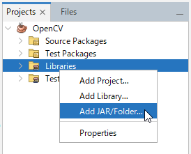
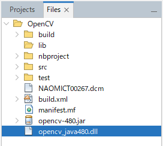

# OpenCV のインストールと基本

## OpenCV のインストール

Java で OpenCV を使用するには、まず OpenCV の Java ライブラリをインストールする必要があります。以下のステップに従ってインストールを行ってください。

OpenCV の公式ウェブサイト（[https://opencv.org/releases/](https://opencv.org/releases/)）から OpenCV の最新バージョンをダウンロードします。
ダウンロードしたファイルを解凍し、`opencv/build/java` ディレクトリを見つけます。
このディレクトリに含まれている opencv-XXX.jar をプロジェクトのクラスパスに追加します。
NetBeans を使っている場合、プロジェクトウィンドウの `Libralies` を右クリック →
`Add JAR/Folder...` から、JAR ファイルを追加することができます。



また、同じ`opencv/build/java` ディレクトリにある libopencv_javaXXX.so（Linux）、opencv_javaXXX.dll（Windows）、または libopencv_javaXXX.dylib（Mac）などのライブラリファイルをシステムのパスに追加します。
パスを追加しなくても、以下のようにプロジェクトと同じディレクトリにファイルを置くことで、利用することもできます。



## OpenCV を使ってみよう

インストールが完了したら、試しに簡単なプログラムで OpenCV が正しく動作するか確認しましょう。

```java
import org.opencv.core.Core;
import org.opencv.core.CvType;
import org.opencv.core.Mat;

public class HelloWorld {
    static {
        System.loadLibrary(Core.NATIVE_LIBRARY_NAME);
    }

    public static void main(String[] args) {
        // 3x3 の単位行列を作成
        Mat mat = Mat.eye(3, 3, CvType.CV_8UC1);
        System.out.println("mat = " + mat.dump());
    }
}
```

上記プログラムは、OpenCV の初期化を行い、`3x3` の単位行列を作成してコンソールに表示するプログラムです。プログラムを実行してコンソールに単位行列が表示されれば、OpenCV のセットアップは成功しています。

## 基本的な OpenCV のデータ構造

OpenCV では `Mat` クラスを使用して画像データを扱います。`Mat` は `Matrix` の略で、画像のピクセル値や多次元の数値データを格納します。色や画像の深度などを指定でき、画像処理の基本となる重要なデータ構造です。

```java
Mat image = new Mat(rows, cols, type);
```

このコードスニペットでは、指定された行数(rows)、列数(cols)で、指定されたタイプ(type)の新しい `Mat` オブジェクトを作成しています。

ここまでで Java と OpenCV の基本的な使い方を学びました。この知識を基に、更に詳しい画像処理やアプリケーションの開発を学んでいくことになります。

<br>
