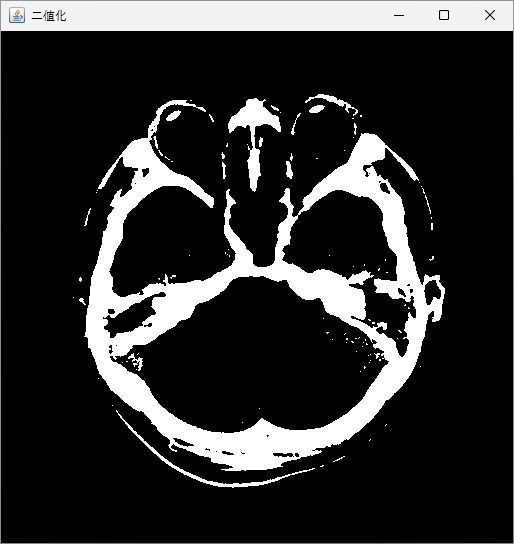
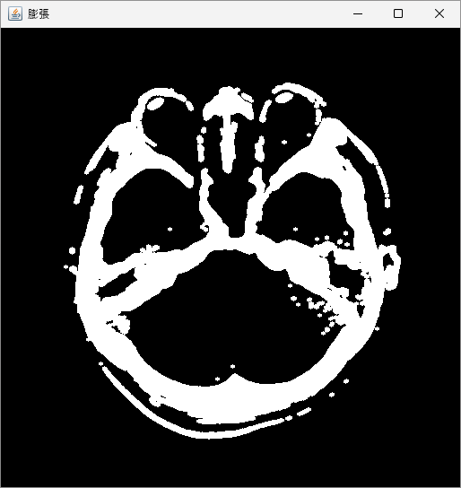
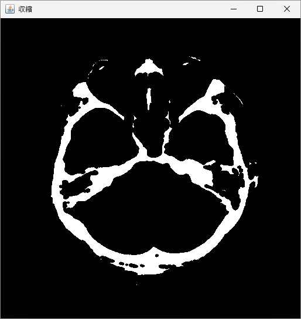
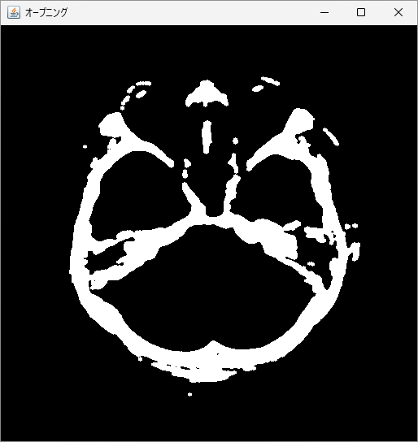
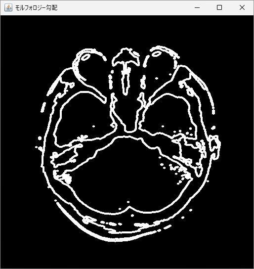

モルフォロジー（Morphology: 形態学）演算は、形状ベースの画像処理操作の総称であり、大きく**膨張（Dilation）処理**と**収縮（Erosion）処理**があります。さらに、これらを組み合わせた**オープニング（Opening）**と**クロージング（Closing）**がよく利用されます。それぞれの処理の適用の際には、構造化要素（kernel）を指定します。

## 構造化要素

構造化要素（Structuring Element）は、モルフォロジー演算を適用する形の行列を指します。
構造化要素の形状やサイズによって、演算の結果も変わってきます。
形状としては「円形」や「矩形」が一般的であり、状況によっては「十字形」などの形状が選択されます。

構造化要素は `Mat` オブジェクトとして定義されますが、代表的な形状であれば `Imgproc.getStructuringElement` メソッドによって簡単に生成することができます。以下のように第 1 引数で形状、第 2 引数でサイズを指定することで、構造化要素の `Mat` を取得できます。

```java
// 構造化要素の作成
Mat kernel = Imgproc.getStructuringElement(Imgproc.MORPH_ELLIPSE, new Size(5, 5));
```

形状のフラグには大きく以下の 3 つが用意されています。

- `Imgproc.MORPH_RECT`: 矩形
- `Imgproc.MORPH_CROSS`: 十字形
- `Imgproc.MORPH_ELLIPSE`: 楕円形

## 膨張と収縮

膨張と収縮は、モルフォロジー演算を構成する基本的な演算です。

### 膨張（Dilation）

膨張は、画像上のオブジェクト境界を拡大します。
構造化要素を用いて画像上を走査し、要素とオブジェクトが一部でも重なる場合、その領域はオブジェクトに含まれるとみなされます。
膨張は `Imgproc.dilate` メソッドによって適用できます。
第 1 引数には入力画像、第 2 引数には出力画像、第 3 引数には構造化要素を指定します。
以下は膨張処理のコード例です。

```java
// ライブラリの読み込み
System.loadLibrary(Core.NATIVE_LIBRARY_NAME);

// 画像の読み込み
Mat image = Imgcodecs.imread("KanoHead.png", Imgcodecs.IMREAD_GRAYSCALE);

// 二値化
Mat binaryImage = new Mat();
Imgproc.threshold(image, binaryImage, 180, 255, Imgproc.THRESH_BINARY);

// 構造化要素の作成
Mat kernel = Imgproc.getStructuringElement(Imgproc.MORPH_ELLIPSE, new Size(5, 5));

// 膨張処理
Mat dst = new Mat();
Imgproc.dilate(binaryImage, dst, kernel);

// 画像の表示
HighGui.imshow("膨張", dst);
HighGui.waitKey();
System.exit(0);
```

{width=49%}
{width=49%}

### 収縮（Erosion）

収縮は、画像上のオブジェクト境界を縮小します。
構造化要素を用いて画像上を走査し、要素とオブジェクトに完全に収まる場合のみ、その領域にオブジェクトが存在するとみなされます。
収縮は `Imgproc.erode` メソッドによって適用できます。
第 1 引数には入力画像、第 2 引数には出力画像、第 3 引数には構造化要素を指定します。
以下は収縮処理のコード例です。

```java
// ライブラリの読み込み
System.loadLibrary(Core.NATIVE_LIBRARY_NAME);

// 画像の読み込み
Mat image = Imgcodecs.imread("KanoHead.png", Imgcodecs.IMREAD_GRAYSCALE);

// 二値化
Mat binaryImage = new Mat();
Imgproc.threshold(image, binaryImage, 180, 255, Imgproc.THRESH_BINARY);

// 構造化要素の作成
Mat kernel = Imgproc.getStructuringElement(Imgproc.MORPH_ELLIPSE, new Size(5, 5));

// 収縮処理
Mat dst = new Mat();
Imgproc.erode(binaryImage, dst, kernel);

// 画像の表示
HighGui.imshow("収縮", dst);
HighGui.waitKey();
System.exit(0);
```

{width=49%}
{width=49%}

## オープニングとクロージング

オープニングとクロージングは、それぞれ収縮と膨張、膨張と収縮を組み合わせた演算です。
このような応用的なモルフォロジー演算は、`Imgproc.morphologyEx` メソッドによって適用することができます。
第 1 引数には入力画像、第 2 引数には出力画像、第 3 引数には演算のフラグ、第 4 引数には構造化要素を指定します。演算のフラグには、以下が用意されています。

- `Imgproc.MORPH_OPEN`: オープニング
- `Imgproc.MORPH_CLOSE `: クロージング
- `Imgproc.MORPH_GRADIENT`: モルフォロジー勾配
- `Imgproc.MORPH_TOPHAT`: トップハット
- `Imgproc.MORPH_BLACKHAT `: ブラックハット
- `Imgproc.MORPH_HITMISS `: Hit-or-Miss 変換

### オープニング（Opening）

オープニングは、収縮を適用したあとに膨張を適用する演算で、小さな領域の除去や平滑化に適しています。
以下はオープニング処理のコード例です。

```java
// ライブラリの読み込み
System.loadLibrary(Core.NATIVE_LIBRARY_NAME);

// 画像の読み込み
Mat image = Imgcodecs.imread("KanoHead.png", Imgcodecs.IMREAD_GRAYSCALE);

// 二値化
Mat binaryImage = new Mat();
Imgproc.threshold(image, binaryImage, 180, 255, Imgproc.THRESH_BINARY);

// 構造化要素の作成
Mat kernel = Imgproc.getStructuringElement(Imgproc.MORPH_ELLIPSE, new Size(5, 5));

// オープニング処理
Mat dst = new Mat();
Imgproc.morphologyEx(binaryImage, dst, Imgproc.MORPH_OPEN, kernel);

// 画像の表示
HighGui.imshow("オープニング", dst);
HighGui.waitKey();
System.exit(0);
```

{width=49%}
{width=49%}

### クロージング（Closing）

クロージングは、膨張を適用したあとに収縮を適用する演算で、小さな穴や隙間を埋めるのに適しています。
以下はクロージング処理のコード例です。

```java
// ライブラリの読み込み
System.loadLibrary(Core.NATIVE_LIBRARY_NAME);

// 画像の読み込み
Mat image = Imgcodecs.imread("KanoHead.png", Imgcodecs.IMREAD_GRAYSCALE);

// 二値化
Mat binaryImage = new Mat();
Imgproc.threshold(image, binaryImage, 180, 255, Imgproc.THRESH_BINARY);

// 構造化要素の作成
Mat kernel = Imgproc.getStructuringElement(Imgproc.MORPH_ELLIPSE, new Size(5, 5));

// クロージング処理
Mat dst = new Mat();
Imgproc.morphologyEx(binaryImage, dst, Imgproc.MORPH_CLOSE, kernel);

// 画像の表示
HighGui.imshow("クロージング", dst);
HighGui.waitKey();
System.exit(0);
```

{width=49%}
{width=49%}

## その他のモルフォロジー演算

OpenCV で利用可能なモルフォロジー演算にはその他にも、モルフォロジー勾配、トップハット、ブラックハット、Hit-or-Miss 変換などがあります。以下ではモルフォロジー勾配について、実装例を紹介します。その他の演算については、必要に応じて公式のドキュメントを参照して確認するようにしてください。

### モルフォロジー勾配

モルフォロジー勾配は、膨張した画像と収縮した画像の差を取ることによって計算され、結果としてエッジが強調された画像が生成されます。
以下はモルフォロジー勾配を適用するコード例です。

```java
// ライブラリの読み込み
System.loadLibrary(Core.NATIVE_LIBRARY_NAME);

// 画像の読み込み
Mat image = Imgcodecs.imread("KanoHead.png", Imgcodecs.IMREAD_GRAYSCALE);

// 二値化
Mat binaryImage = new Mat();
Imgproc.threshold(image, binaryImage, 180, 255, Imgproc.THRESH_BINARY);

// 構造化要素の作成
Mat kernel = Imgproc.getStructuringElement(Imgproc.MORPH_ELLIPSE, new Size(5, 5));

// モルフォロジー勾配
Mat dst = new Mat();
Imgproc.morphologyEx(binaryImage, dst, Imgproc.MORPH_GRADIENT, kernel);

// 画像の表示
HighGui.imshow("モルフォロジー勾配", dst);
HighGui.waitKey();
System.exit(0);
```

{width=49%}
{width=49%}

<br>
