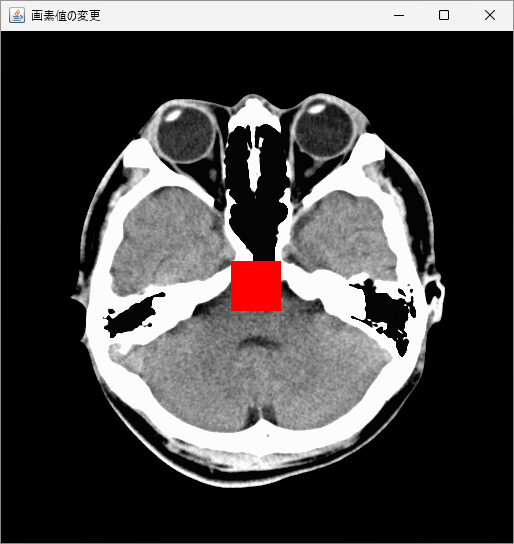

本セクションでは、Java と OpenCV を用いて、画像の画素（ピクセル）にアクセスして値を変更する方法を学びます。
画素値の参照や変更は、画像処理における最も基本的な操作の一つです。

## 画素値

画像は、画素（ピクセル）と呼ばれる小さな点の集合体です。各画素は、特定の色を持ち、これが集まることで画像と認識することができるようになります。 カラー画像の場合、ほとんどの画像フォーマットで RGB（赤、緑、青）の 3 色を用いて色を表現します（OpenCV では BGR の並びがデフォルトとなります）。画素値にはこれらの各色の情報が含まれ、通常は 0（最低）から 255（最高）の範囲で定義されています。

## 画素値の参照

OpenCV の [`Mat`](https://docs.opencv.org/4.x/javadoc/org/opencv/core/Mat.html) オブジェクトの画素値を参照するには、`get` メソッドを用います。引数に取得したい画素の `row` と `col` を指定すると、その画素値の BGR 情報が `double[]` で返ってきます。特定の画素値 `(255, 255)` の情報を取得し、コンソールに結果を表示するコードは以下のようになります。

```java
// ライブラリの読み込み
System.loadLibrary(Core.NATIVE_LIBRARY_NAME);

// 画像の読み込み
Mat image = Imgcodecs.imread("KanoHead.png");

// 画素値の参照
double[] pixelValue = image.get(255, 255);
System.out.println("Blue: " + pixelValue[0]);
System.out.println("Green: " + pixelValue[1]);
System.out.println("Red: " + pixelValue[2]);
```

```title="実行結果"
Blue: 132.0
Green: 132.0
Red: 132.0
```

`KanoHead.png` はグレースケールの CT 画像であるため、各画素の BGR 値はすべて同じになります。

!!! note

    グレースケール変換などの操作によって [`Mat`](https://docs.opencv.org/4.x/javadoc/org/opencv/core/Mat.html) がグレースケース化されている場合は、`get` メソッドで取得できるのはグレースケール値（`pixelValue[0]`）のみとなります。

### 画素値の変更

[`Mat`](https://docs.opencv.org/4.x/javadoc/org/opencv/core/Mat.html) オブジェクトの画素の値を変更するには、`put` メソッドを用います。第 1 引数に `row`、第 2 引数に `col`、第 3 引数に BGR 値などの色情報を指定することで、任意の画素値に変更することができます。以下は、for 文を用いて中央の矩形領域を赤色に置き換えるコード例です。

```java
// ライブラリの読み込み
System.loadLibrary(Core.NATIVE_LIBRARY_NAME);

// 画像の読み込み
Mat image = Imgcodecs.imread("KanoHead.png");

// 画素値の変更
double[] newPixelValue = {0, 0, 255};
for (int y = 230; y < 280; y++) {
    for (int x = 230; x < 280; x++) {
        image.put(x, y, newPixelValue);
    }
}

// 画像の表示
HighGui.imshow("画素値の変更", image);
HighGui.waitKey();
System.exit(0);
```



画素値の情報を取得し、分岐を作成することで、二値化処理を実装することもできます。

<br>
