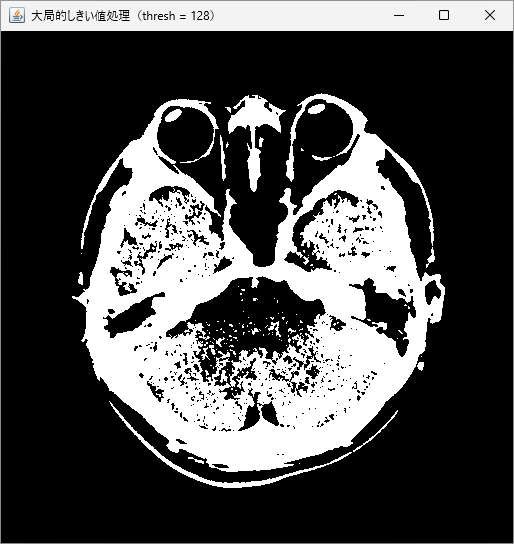
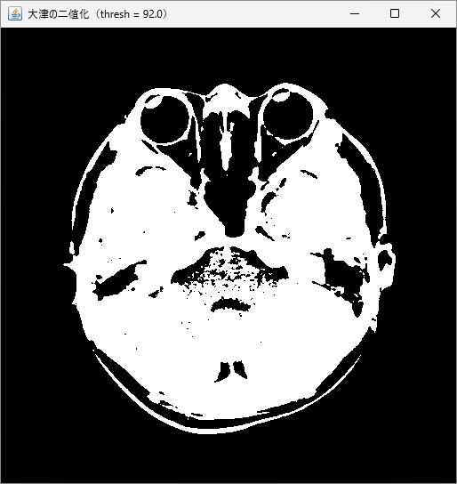
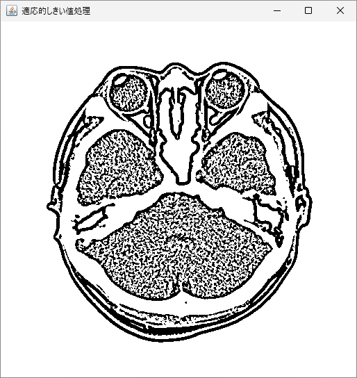

# 二値化

画像のセグメンテーションの最も単純な方法として、二値化（binarization）またはしきい値処理（thresholding）があります。二値化とは、画素値がしきい値よりも大きければ白、そうでなければ黒を割り当てるといったように、ルールに従って画像を二値に変更する操作のことです。OpenCV で二値化を適用するには、グレースケール画像に対して `threshold` メソッドを用います。第 1 引数にはグレースケール画像、第 2 引数にはしきい値、第 3 引数には画素の最大値、第 4 引数には処理のフラグを指定します。

## 二値化処理のフラグ

代表的な二値化処理のフラグには、以下のようなものがあります。

- `Imgproc.THRESH_BINARY`
- `Imgproc.THRESH_BINARY_INV`
- `Imgproc.THRESH_TRUNC`
- `Imgproc.THRESH_TOZERO`
- `Imgproc.THRESH_TOZERO_INV`
- `Imgproc.THRESH_OTSU`

詳細については、公式ドキュメント（[Image Thresholding](https://docs.opencv.org/4.x/d7/d4d/tutorial_py_thresholding.html)） を参照してください。

## 大局的しきい値による二値化

最も単純な二値化の考え方として、大局的な一つのしきい値を事前に設定し、その値よりも大きければ白、小さければ黒にするというものがあります。この方法は **大局的しきい値処理** とも呼ばれ、OpenCV においては `Imgproc.THRESH_BINARY` フラグで表現されます。以下は、大局的しきい値処理を行うサンプルコードです。

```java
// ライブラリの読み込み
System.loadLibrary(Core.NATIVE_LIBRARY_NAME);

// 画像の読み込み
Mat image = Imgcodecs.imread("KanoHead.png", Imgcodecs.IMREAD_GRAYSCALE);

// 大局的しきい値処理
Mat binaryImage = new Mat();
Imgproc.threshold(image, binaryImage, 128, 255, Imgproc.THRESH_BINARY);

// 画像の表示
HighGui.imshow("大局的しきい値処理（thresh = 128）", binaryImage);
HighGui.waitKey();
System.exit(0);
```



`threshold` の第 3 引数の値（しきい値）を変更することで、結果の変化を確認することができます。

## 大津の二値化

二値化において、しきい値を自動的に決定する代表的な手法として、**大津の二値化** があります。大津の二値化では、ヒストグラムの分離度を最大化するようにしきい値を自動決定します。理論の詳細については公式ドキュメントを参照するようにしてください。大津の二値化は、`threshold` メソッドの第 5 引数で `Imgproc.THRESH_OTSU` フラグを指定することで利用できます。このとき、第 3 引数のしきい値には数値を入れることができますが、大津の二値化ではしきい値が自動決定されるため入力した値は無視されます。また、自動決定されたしきい値は、`threshold` の返り値で確認することができます。

以下は、大津の二値化の実装例です。

```java
// ライブラリの読み込み
System.loadLibrary(Core.NATIVE_LIBRARY_NAME);

// 画像の読み込み
Mat image = Imgcodecs.imread("KanoHead.png", Imgcodecs.IMREAD_GRAYSCALE);

// 大局的しきい値処理
Mat binaryImage = new Mat();
double thresh = Imgproc.threshold(image, binaryImage, 0, 255, Imgproc.THRESH_OTSU);

// 画像の表示
HighGui.imshow("大津の二値化（thresh = " + thresh + "）", binaryImage);
HighGui.waitKey();
System.exit(0);
```



しきい値として `92` という値が決定されていることが確認できます。

## 適応的しきい値処理

一つのしきい値ではうまく領域分割ができない場合は、特定領域ごとに適応的にしきい値を決定する **適応的閾値処理 (Adaptive Thresholding)** が有効である可能性があります。適応的しきい値処理は、`adaptiveThreshold` メソッドによって行うことができます。以下は、実際のコード例です。

```java
// ライブラリの読み込み
System.loadLibrary(Core.NATIVE_LIBRARY_NAME);

// 画像の読み込み
Mat image = Imgcodecs.imread("KanoHead.png", Imgcodecs.IMREAD_GRAYSCALE);

// 適応的しきい値処理
Mat binaryImage = new Mat();
int blockSize = 11; // ブロックサイズ（奇数）
int C = 2; // 定数（平均または中央値から引く値）
Imgproc.adaptiveThreshold(image, binaryImage, 255, Imgproc.ADAPTIVE_THRESH_GAUSSIAN_C, Imgproc.THRESH_BINARY, blockSize, C);

// 画像の表示
HighGui.imshow("適応的しきい値処理", binaryImage);
HighGui.waitKey();
System.exit(0);
```



<br>

このセクションで触れた二値化処理の詳細については、公式ドキュメント（[Image Thresholding](https://docs.opencv.org/4.x/d7/d4d/tutorial_py_thresholding.html)） で確認することができます。各手法の利点や欠点について、考えながら実装してみてください。

<br>
